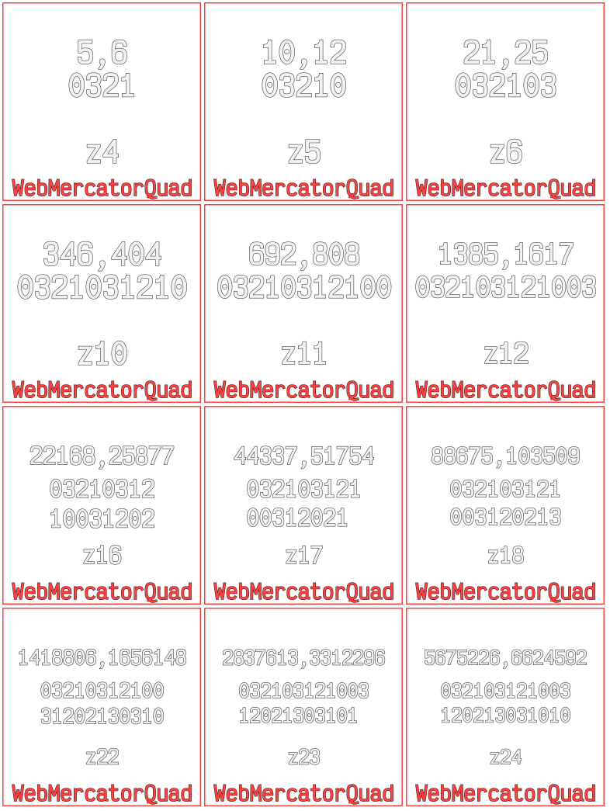

# Debug XYZ tile server

Generates debug tiles to overlay in systems that consume XYZ tiles



## Format

Images are output with a red border, QuadKey and XYZ tile information

```
X, Y
QuadKey
Zoom
```

# Usage

```
npm i -g xyz-tile-debug

xyz-tile-debug
open http://localhost:8855/v1/tiles/WebMercatorQuad/10/10/10.png
open http://localhost:8855/v1/wmts/WMTSCapabilities.xml
```

or with docker

```
docker run  -it -p 8855:8855 blacha/xyz-tile-debug
open http://localhost:8855/v1/tiles/WebMercatorQuad/10/10/10.png
open http://localhost:8855/v1/wmts/WMTSCapabilities.xml
```

# Building

This requires [NodeJs](https://nodejs.org/en/) > 12 & [Yarn](https://yarnpkg.com/en/)

Use [n](https://github.com/tj/n) to manage nodeJs versions

```bash
# Download the latest nodejs & yarn
n latest
npm install -g yarn

# Install node deps
yarn

# Build everything into /build
yarn run build

# Run the unit tests
yarn run test

# Start the server
yarn run start
```

The server will start on a random port `8855`, this can be configured using the `PORT` environment variable

```shell
PORT=1234 yarn run start
```
